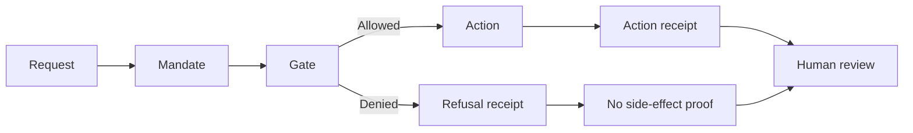
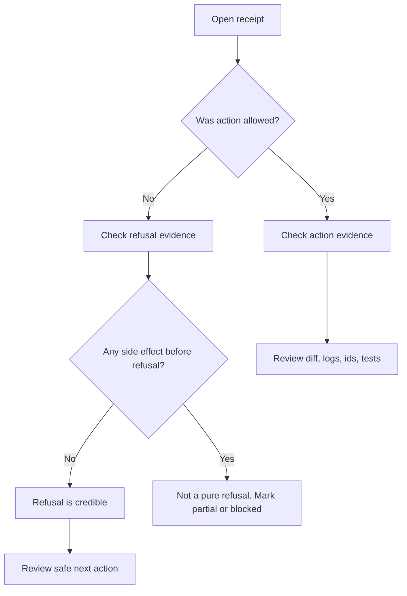

# Visual overview

This page gives a one-screen visual explanation of the standard.

## One-line idea

> An AI agent should prove what it did, what it did not do, and why.

## The flow



Plain meaning:

1. A request arrives.
2. The mandate says what the agent is allowed to do.
3. A gate checks the request against the mandate.
4. If allowed, the agent may act and leave an action receipt.
5. If denied, the agent must not act and must leave a refusal receipt.
6. A human can review the evidence.

## One-screen table

| Step | Plain question | Evidence to leave |
| --- | --- | --- |
| Request | What was the agent asked to do? | `requested_action` |
| Mandate | Was the agent allowed to do it? | `mandate_id`, boundary fields |
| Gate | Which rule allowed or denied it? | `policy`, `checks_run`, `refusal_reasons` |
| Action | Did anything actually happen? | `actual_action`, changed files, command logs, external ids |
| Refusal | If denied, did execution stay stopped? | `execution_started: false`, `external_calls_made: false` |
| Review | Can someone check it later? | `replay`, `content_hash`, `safe_next_action` |

## Allowed action vs refused action

| Scenario | What happens | Receipt type |
| --- | --- | --- |
| Agent edits an allowed local file | Action runs, evidence is recorded | Action receipt |
| Agent is asked to send without approval | Action does not run, denial is recorded | Refusal receipt |
| Agent needs approval but none exists | Agent waits, no side effect happens | Not-authorized receipt |
| Agent starts but cannot finish safely | Partial state is recorded honestly | Partial or blocked receipt |

## Refusal receipt in one screen

| Required proof | Example |
| --- | --- |
| What was requested? | `external_send` |
| What denied it? | `external_send_approval_missing` |
| Did execution start? | `false` |
| Were external calls made? | `false` |
| Were files changed? | `[]` |
| Can the decision be replayed? | yes, via `replay_inputs` and `verification_steps` |
| What should happen next? | draft for human review |

## Simple example

Someone asks an agent:

> Send this email to the client now.

The agent boundary says:

> You may draft messages, but you may not send them.

The correct result is:

```text
status: NOT_AUTHORIZED
actual_action: none
execution_started: false
external_calls_made: false
safe_next_action: draft the message for human review
```

## What a reviewer should look for



## Mental model

```text
No mandate -> no action
No approval -> no sensitive action
No receipt -> no claim accepted
No proof of non-execution -> refusal not trusted
```

## Best first files

| Reader | Start with |
| --- | --- |
| Non-technical visitor | `START_HERE.md` |
| Founder or operator | `README.md` then examples |
| Developer | templates, schema, validator |
| Compliance or legal reviewer | refusal requirements and examples |
| Security reviewer | no-side-effect attestation and replay fields |
